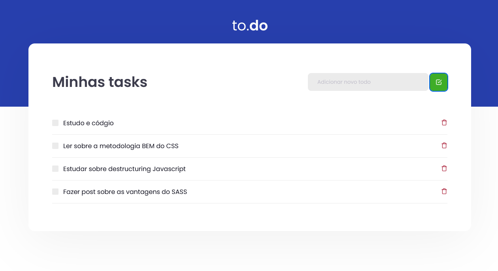

# to.do

<!---Esses são exemplos. Veja https://shields.io para outras pessoas ou para personalizar este conjunto de escudos. Você pode querer incluir dependências, status do projeto e informações de licença aqui--->




> Linha adicional de texto informativo sobre o que o projeto faz. Sua introdução deve ter cerca de 2 ou 3 linhas. Não exagere, as pessoas não vão ler.

## Objetivo

- Treinar os conhecimentos iniciais no React através de uma aplicação que simula uma lista de tarefas

## 🚀 Instalando as dependências

```
yarn init -y
yarn add react
yarn add react-dom
```

## 🤝 Colaboradores

Agradecemos às seguintes pessoas que contribuíram para este projeto:

<table>
  <tr>
    <td align="center">
      <a href="">
        <br>
        <sub>
          <b>Uítalo Souza</b>
        </sub>
      </a>
    </td>
</table>

[⬆ Voltar ao topo](#nome-do-projeto)<br>
